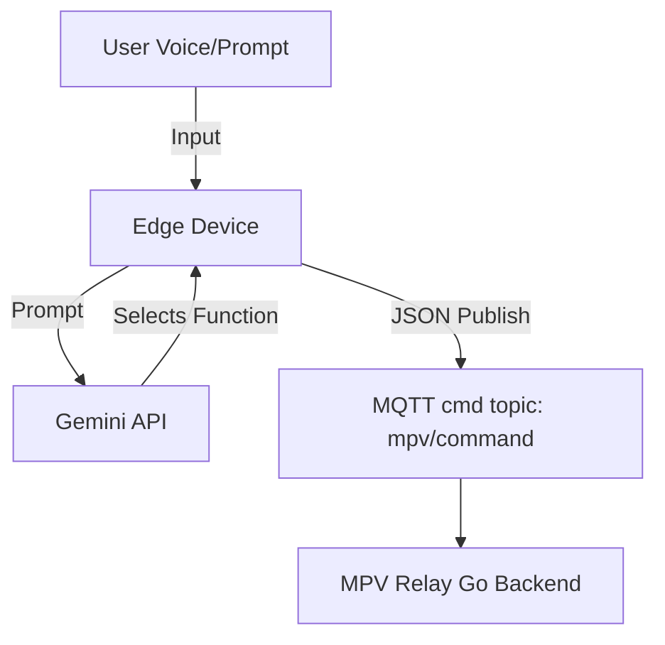

# Assistant Edge Device Integration Guide

This guide explains how to connect Gemini LLM Function/Tool Calling to an **assistant/edge device** (such as a smart speaker, voice-controlled media remote, or wake-word device) that issues control commands to the MPV Relay Go Backend.

---

## Edge Device Command Architecture

An assistant/edge device acts primarily as a **producer of commands**. It listens to voice/text prompts from the user, uses Gemini to select the correct playback function, and publishes the command payload to the MQTT broker.



### Key Differences from Web Client
1. **Write-Only Focus**: An edge control device rarely needs to render a full UI. Thus, query/read tools like `status`, `history`, `queue_list`, `search`, and `get_cached_songs` are omitted from the tool-call set to save CPU, bandwidth, and context window.
2. **Simplified Payload Mapping**: Only direct playback control commands (e.g., play, pause, volume) are exposed to the LLM.

---

## Supported Assistant Commands

When the LLM decides to trigger a tool, map the argument payload directly into the JSON format below and publish it to the `mpv/command` topic:

| Gemini Tool | Description | MQTT Command Payload |
| :--- | :--- | :--- |
| **`play`** | Plays a query immediately. | `{"cmd": "play", "query": "<query>"}` |
| **`queue`** | Appends a query to the queue. | `{"cmd": "queue", "query": "<query>"}` |
| **`play_next`** | Queues a query to play next. | `{"cmd": "play_next", "query": "<query>"}` |
| **`pause`** | Pauses media playback. | `{"cmd": "pause"}` |
| **`resume`** | Resumes media playback. | `{"cmd": "resume"}` |
| **`stop`** | Stops playback and clears all states. | `{"cmd": "stop"}` |
| **`next`** | Skips current track. | `{"cmd": "next"}` |
| **`previous`** | Plays previous track. | `{"cmd": "previous"}` |
| **`seek`** | Seeks position in seconds. | `{"cmd": "seek", "seconds": <seconds>}` |
| **`volume`** | Adjusts player volume. | `{"cmd": "volume", "level": <level>}` |
| **`mute`** | Toggles mute state. | `{"cmd": "mute"}` |
| **`shuffle`** | Shuffles manual play queue. | `{"cmd": "shuffle"}` |
| **`clear`** | Clears manual play queue. | `{"cmd": "clear"}` |
| **`autoplay`** | Enables/disables recommendation pool. | `{"cmd": "autoplay", "enabled": <true/false>}` |

---

## Integration Code Example (Python)

Ensure you have the required packages:
```bash
pip install google-generativeai paho-mqtt
```

Use this script on your edge device to translate voice prompts directly to MQTT control commands:

```python
import json
import paho.mqtt.client as mqtt
import google.generativeai as genai

# Configure Gemini
genai.configure(api_key="YOUR_GEMINI_API_KEY")

# Load only the assistant-centric tool definitions
with open("gemini_assistant_tools.json", "r") as f:
    assistant_tools = json.load(f)

model = genai.GenerativeModel(
    model_name="gemini-1.5-flash",
    tools=assistant_tools
)

# MQTT Broker Configuration (load from .env where applicable)
MQTT_BROKER = "5f8663f0cabe4e34961fb727113441f3.s1.eu.hivemq.cloud"
MQTT_PORT = 8883
MQTT_USER = "raspberrypi"
MQTT_PASSWORD = "Pass@pi2026"
CMD_TOPIC = "mpv/command"

client = mqtt.Client()
client.username_pw_set(MQTT_USER, MQTT_PASSWORD)
client.tls_set()  # Required for HiveMQ Cloud TLS

client.connect(MQTT_BROKER, MQTT_PORT)
client.loop_start()

def process_voice_command(prompt: str):
    print(f"User Prompt: {prompt}")
    
    # Generate content using the control tools
    response = model.generate_content(
        f"You are a media remote. Convert the user prompt into a tool call: {prompt}"
    )
    
    # Process tool call
    if response.candidates and response.candidates[0].content.parts:
        for part in response.candidates[0].content.parts:
            if hasattr(part, 'function_call') and part.function_call:
                func = part.function_call
                
                # Format payload
                payload = {
                    "cmd": func.name,
                    **func.args
                }
                
                # Publish to backend
                client.publish(CMD_TOPIC, json.dumps(payload), qos=1)
                print(f"Published Command: {payload}")
                return
                
    # If no tool call was generated
    print(f"Assistant: {response.text}")

# Voice remote examples
process_voice_command("Volume up to 80 percent")
process_voice_command("Play some classical jazz music")
process_voice_command("Mute the player")
```
