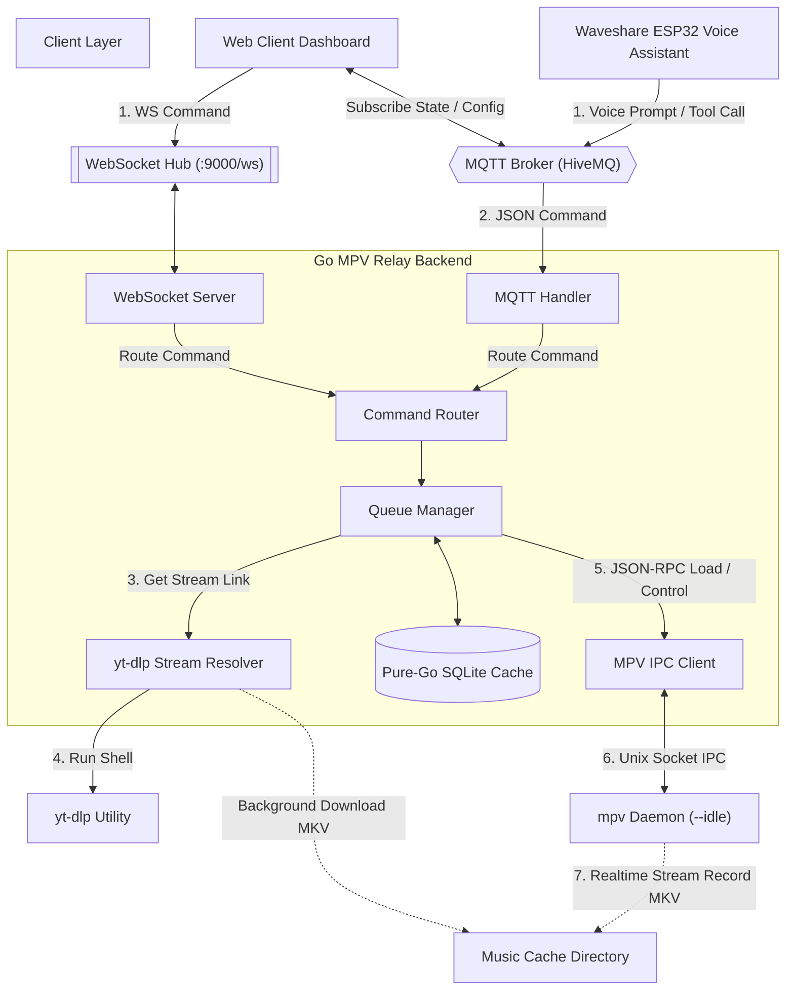

# 🎛️ MPV Media Player Relay Backend (Go)

[](https://go.dev/)
[](https://modernc.org/sqlite)
[](LICENSE)

An advanced, event-driven media player controller and stream relay service written in Go. This backend is specifically built to fulfill the **media player and command-routing proxy** requirements of the **[Waveshare Audio Development Board (ESP32-S3) Voice Assistant Client](file:///home/ankitm/ai-assistant/waveshare/README.md)**. 

It runs locally alongside `mpv`, listening to commands over **MQTT** (optimized for low-power edge voice-assistants) and **WebSockets** (for rich web clients/dashboards), resolving streaming links dynamically via `yt-dlp`, managing a local SQlite audio cache, and coordinating state synchronization with the ESP32 assistant board.

---

## 📖 Table of Contents
1. [System Architecture](#-system-architecture)
2. [Key Features](#-key-features)
3. [Internal Packages & Code Structure](#-internal-packages--code-structure)
4. [Voice Assistant & Device Integration](#-voice-assistant--device-integration)
5. [Getting Started & Dependencies](#-getting-started--dependencies)
6. [Configuration (.env)](#-configuration-env)
7. [Running & Building](#-running--building)

---

## 🏗️ System Architecture

The Go MPV Relay Backend serves as the central orchestration layer, bridging the low-power Waveshare ESP32 edge device, high-fidelity web client control panels, the `mpv` hardware media player daemon, and online media streaming platforms:



---

## 🌟 Key Features

*   **Dual Protocol Command Routing**: Receives JSON commands via MQTT command topic (`mpv/command`) or WebSocket connection (`ws://<host>:9000/ws`), parsing them concurrently using an asynchronous, panic-safe router.
*   **Smart Voice Assistant Coordination**: Automatically intercepts wake-word and assistant activation triggers (`assistant_pause` / `assistant_play`). It temporarily pauses `mpv` playback when the assistant starts listening/speaking, and resumes playback upon conversation end *only* if music was active before the interruption.
*   **On-The-Fly Stream Caching & Pre-downloading**:
    *   Instructs `mpv` to record network media streams to local files (`stream-record`) in real-time as they play.
    *   Saves downloads directly as best-audio `.mkv` files in the music cache directory, eliminating redundant network traffic for repeat plays.
    *   Supports immediate background pre-downloading (`download`) without interrupting current audio.
*   **Pure-Go Persistence Layer**: Utilizes a CGO-free SQLite driver (`modernc.org/sqlite`) to store play history, search query mapping, metadata caching, and download tracking. Simplifies cross-compilation to any platform without needing a C/C++ compiler.
*   **Dynamic Autoplay & Related Scraping**: When the manual queue runs dry, the queue manager scrapes YouTube Music (with watch page fallback) for related track recommendations, pre-resolving the next item in the background to ensure gapless transition.
*   **Device Configuration Bridging**: Acts as an admin proxy. Web clients can issue `device_config_get/set` or `gemini_config_get/set` commands via WebSocket, which the Go server translates to MQTT payloads to remotely query or alter the Waveshare ESP32 board's local configurations.

---

## 📂 Internal Packages & Code Structure

```
mpv-relay-backend-go/
├── cmd/
│   └── relay/
│       └── main.go                 # Main entrypoint; handles PID locks, DI, and servers startup
│
├── internal/
│   ├── config/                     # Configuration loader for .env environment files
│   ├── db/                         # Pure-Go SQLite database interface and schema migrations
│   ├── mpv/                        # Thread-safe JSON-RPC client for MPV UNIX IPC socket
│   ├── mqtt/                       # MQTT client, connection manager, and topic subscriptions
│   ├── queue/                      # Core play queue, autoplay logic, and assistant state tracker
│   ├── resolver/                   # yt-dlp search scraper, scraping engines, and thumbnail downloaders
│   ├── router/                     # JSON schema validator and async command dispatcher
│   └── ws/                         # Gorilla WebSocket hub, broadcasting server state
│
├── ASSISTANT_INTEGRATION.md        # Edge/Voice assistant integration guide
├── WEB_CLIENT_INTEGRATION.md       # Web client websocket/state integration guide
├── gemini_assistant_tools.json     # LLM tool definitions for the Voice Assistant
├── gemini_web_tools.json           # LLM tool definitions for the Web UI Client
├── Makefile                        # Platform compilation rules
└── go.mod                          # Go module dependencies
```

---

## 🎙️ Voice Assistant & Device Integration

This relay server provides a seamless bridge for voice assistant edge devices (such as the Waveshare board) to act as media remote controls:

1.  **Voice Remote Tool Calling**: When the user says *"Play some lofi music"* to the Waveshare board, the onboard Gemini Live client interprets the voice query, generates a tool-call matching the schema in `gemini_assistant_tools.json`, and publishes `{"cmd": "play", "query": "lofi music"}` to `mpv/command`.
2.  **Audio Ducking/Pausing**: When the wake-word is detected locally on the board, it publishes `{"cmd": "assistant_pause"}`. The backend pauses the audio stream instantly. Once the assistant finished speaking its response or the connection terminates, it publishes `{"cmd": "assistant_play"}` to restore audio.
3.  **Status Broadcasting**: The backend broadcasts status updates (`mpv/status`) detailing the current track title, artist, play state, duration, and volume. The ESP32 and WebUI listen to this topic to keep their local displays synced.

---

## ⚙️ Getting Started & Dependencies

### Prerequisites
1.  **Go SDK**: Go 1.25+ installed on the host machine.
2.  **mpv Player**: Install `mpv` on the host machine.
    *   *Ubuntu/Debian:* `sudo apt install mpv`
    *   *macOS:* `brew install mpv`
3.  **yt-dlp**: Required to search and resolve streaming media links.
    *   *Ubuntu/Debian:* `sudo apt install yt-dlp` or install directly to PATH from github releases.
4.  **MQTT Broker**: A HiveMQ Cloud cluster, local Mosquitto broker, or similar.

---

## 🛠️ Configuration (.env)

Copy `.env.example` to `.env` and configure your settings:

```bash
cp .env.example .env
```

| Environment Variable | Description | Default |
| :--- | :--- | :--- |
| `MQTT_BROKER` | Address of your HiveMQ or MQTT Broker | `your-cluster.s1.eu.hivemq.cloud` |
| `MQTT_PORT` | Port of the broker (usually 8883 for TLS, 1883 for plain) | `8883` |
| `MQTT_USERNAME` | Username for MQTT authentication | *Required* |
| `MQTT_PASSWORD` | Password for MQTT authentication | *Required* |
| `MQTT_TOPIC_CMD` | Topic the backend listens to for commands | `mpv/command` |
| `MQTT_TOPIC_STATUS` | Topic where playback status is published | `mpv/status` |
| `MPV_SOCKET` | Absolute path to MPV's input IPC socket | `/tmp/mpvsocket` |
| `WS_ADDR` | Listen address for Web Socket clients | `:9000` |
| `MUSIC_CACHE_DIR` | Directory to save cached `.mkv` files and thumbnails | `~/mpv-relay/media` |
| `DB_PATH` | Path to store the SQLite caching database | `~/mpv-relay/data/relay.db` |
| `LOG_PATH` | Path to log files (with automatic rotation) | `~/mpv-relay/logs/relay.log` |
| `YTDLP_BIN` | Custom path to the `yt-dlp` executable | *Falls back to PATH* |

---

## 🚀 Running & Building

### 1. Start the MPV Player Daemon
The backend expects `mpv` to be running in idle mode with JSON-IPC enabled. Launch it in the background or a separate terminal:

```bash
mpv --idle --no-video --input-ipc-server=/tmp/mpvsocket
```

### 2. Run the Relay Backend Locally
Start the Go application in development mode:

```bash
make run
```

### 3. Build for Production (Host Platform)
Generate a stripped, optimized binary for your current operating system:

```bash
make build
```
The compiled binary will be placed in the `build/` directory as `mpv-relay`.

### 4. Cross-Compilation
Because the SQLite database is written in pure Go and CGO is disabled, you can easily build binaries for other target architectures (e.g. running on a Raspberry Pi serving as your home media center):

```bash
# Build for all platforms (Linux x64, ARM64, ARMv7, macOS, Windows)
make build-all

# Target Raspberry Pi 4/5 64-bit specifically
make build-linux-arm64
```
All builds will be compiled to `build/mpv-relay-<os>-<arch>`.
