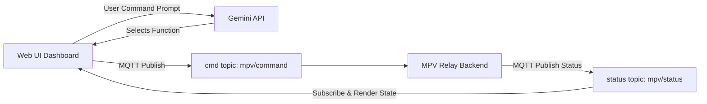

# Web Client Integration Guide

This guide explains how to connect Gemini LLM Function/Tool Calling to a **web/UI client** (such as a dashboard, dashboard controller, or player front-end) interacting with the MPV Relay Go Backend.

---

## Web Client Architecture

A web client is a **bi-directional consumer and producer**. It needs to render the current queue, playing status, history, search results, and local cache listings. It also allows the user to query or control the player via voice or typing prompts.



---

## Complete Web Client Commands Reference

All commands defined in `gemini_web_tools.json` must be translated to a JSON payload with the name of the function as the `"cmd"` value and published to the `mpv/command` topic.

### 1. Control Commands
* **`play`**: `{"cmd": "play", "query": "<query>"}` (Plays immediately, clears queue)
* **`queue`**: `{"cmd": "queue", "query": "<query>"}` (Appends to manual queue)
* **`play_next`**: `{"cmd": "play_next", "query": "<query>"}` (Plays immediately after current)
* **`pause`**: `{"cmd": "pause"}` (Pauses player)
* **`resume`**: `{"cmd": "resume"}` (Resumes player)
* **`stop`**: `{"cmd": "stop"}` (Stops playback, clears queue/autoplay pool)
* **`next`**: `{"cmd": "next"}` (Skips current track)
* **`previous`**: `{"cmd": "previous"}` (Plays previous track from history)
* **`seek`**: `{"cmd": "seek", "seconds": <seconds>}` (Seeks player position)
* **`volume`**: `{"cmd": "volume", "level": <level>}` (Sets player volume level)
* **`mute`**: `{"cmd": "mute"}` (Toggles mute)
* **`shuffle`**: `{"cmd": "shuffle"}` (Shuffles manual queue)
* **`clear`**: `{"cmd": "clear"}` (Clears manual queue)
* **`autoplay`**: `{"cmd": "autoplay", "enabled": <true/false>}` (Enables/disables autoplay recommendations)

### 2. Query / UI Retrieval Commands
* **`status`**: `{"cmd": "status"}` (Forces broadcast of full status payload)
* **`queue_list`**: `{"cmd": "queue_list"}` (Requests current manual queue list)
* **`history`**: `{"cmd": "history"}` (Requests last 20 played songs)
* **`download`**: `{"cmd": "download", "video_id": "<video_id>"}` (Downloads a track in the background)
* **`search`**: `{"cmd": "search", "query": "<query>"}` (Searches YouTube, publishes result)
* **`get_cached_songs`**: `{"cmd": "get_cached_songs", "page": <page>, "limit": <limit>}` (Requests paginated cached songs list)

---

## Integration Code Example (Node.js/JavaScript)

Ensure you have installed the required packages:
```bash
npm install @google/generative-ai mqtt
```

```javascript
import { GoogleGenAI } from '@google/generative-ai';
import mqtt from 'mqtt';
import fs from 'fs';

// Load full web-client tool set
const webTools = JSON.parse(fs.readFileSync('gemini_web_tools.json', 'utf8'));

// Initialize Gemini
const ai = new GoogleGenAI({ apiKey: process.env.GEMINI_API_KEY });
const model = ai.getGenerativeModel({
  model: 'gemini-1.5-flash',
  tools: [{ functionDeclarations: webTools }]
});

// MQTT Setup
const brokerUrl = 'mqtts://5f8663f0cabe4e34961fb727113441f3.s1.eu.hivemq.cloud:8883';
const options = {
  username: 'raspberrypi',
  password: 'Pass@pi2026',
  clientId: 'web-client-controller'
};

const client = mqtt.connect(brokerUrl, options);
const CMD_TOPIC = 'mpv/command';
const STATUS_TOPIC = 'mpv/status';

client.on('connect', () => {
  console.log('Connected to MQTT Broker');
  client.subscribe(STATUS_TOPIC);
  
  // Request initial status on boot
  client.publish(CMD_TOPIC, JSON.stringify({ cmd: 'status' }));
});

// Subscribe to status updates to keep UI state synchronised
client.on('message', (topic, message) => {
  const data = JSON.parse(message.toString());
  console.log(`Received UI Event: ${data.type}`);
  
  switch(data.type) {
    case 'status':
      updatePlaybackUI(data);
      break;
    case 'search_results':
      renderSearchResults(data.results);
      break;
    case 'cached_songs_list':
      renderCachedSongs(data.items, data.has_more);
      break;
    case 'history':
      renderHistory(data.items);
      break;
    default:
      console.log('Other event:', data);
  }
});

async function runPrompt(text) {
  console.log(`Processing prompt: "${text}"`);
  const response = await model.generateContent(text);
  
  const calls = response.response.functionCalls;
  if (calls && calls.length > 0) {
    const payload = {
      cmd: calls[0].name,
      ...calls[0].args
    };
    client.publish(CMD_TOPIC, JSON.stringify(payload));
    console.log('Sent Command:', payload);
  } else {
    console.log('Gemini Answer:', response.response.text());
  }
}

// Dummy UI Handlers
function updatePlaybackUI(status) {
  console.log(`UI Update: Playing "${status.title}" [${status.state}]`);
}
function renderSearchResults(results) {
  console.log(`UI Search Results count: ${results.length}`);
}
function renderCachedSongs(songs) {
  console.log(`UI Cached Songs count: ${songs.length}`);
}
function renderHistory(items) {
  console.log(`UI Play History count: ${items.length}`);
}
```

---

## MQTT status Message Schemas

### 1. Unified status Payload (`"type": "status"`)
```json
{
  "type": "status",
  "state": "playing", 
  "position": 105.5,
  "duration": 300.0,
  "volume": 60,
  "title": "Bohemian Rhapsody",
  "uploader": "Queen",
  "thumbnail_url": "...",
  "queue_length": 2,
  "autoplay": true,
  "next_autoplay": {
    "title": "Don't Stop Me Now",
    "video_id": "HgzGwKwLmgM",
    "cached": false
  },
  "up_next": [
    { "position": 1, "video_id": "abc", "title": "Song A", "source": "queue" },
    { "position": 2, "video_id": "xyz", "title": "Song B", "source": "autoplay" }
  ]
}
```

### 2. Search Results Payload (`"type": "search_results"`)
```json
{
  "type": "search_results",
  "query": "Queen",
  "results": [
    { "id": "fJ9rUzIMcZQ", "title": "Queen - Bohemian Rhapsody", "uploader": "Queen Official", "duration": 359 }
  ]
}
```

### 3. Cached Songs List Payload (`"type": "cached_songs_list"`)
```json
{
  "type": "cached_songs_list",
  "page": 1,
  "limit": 10,
  "total": 32,
  "has_more": true,
  "items": [
    { "query": "...", "video_id": "...", "title": "...", "cached": true }
  ]
}
```
